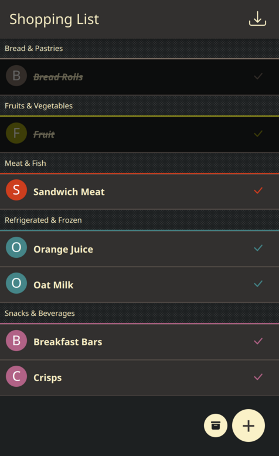
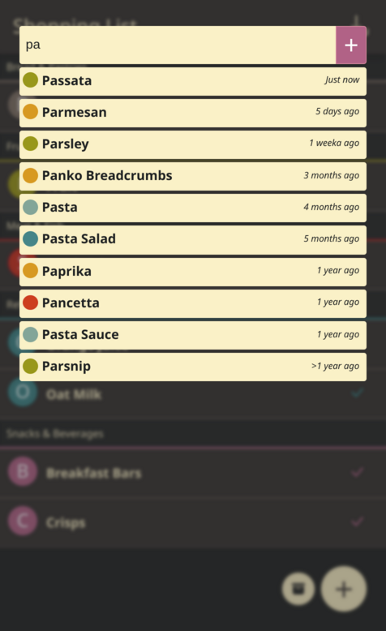
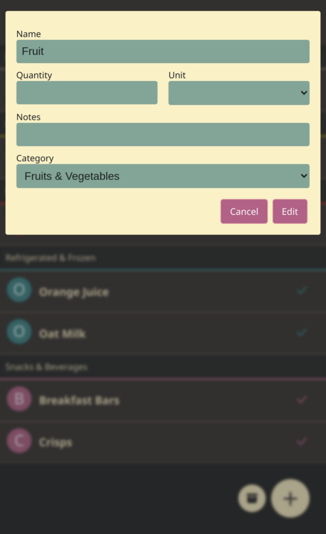

# Shopping List App

This is a fairly basic shopping list web app. The motivation behind creating this was to replace an (native) android app that I had been using for several years, but discovered it had been removed from the play store when I got a new phone.

It allows items to be added to the list, along with an optional quantity, unit and note. Items can be categorised into one of the predefined categories. The list is organised by category.

Once initially loaded, the web app works completely offline and is installable as a progressive web app.

When adding items to the list, suggestions will be presented based on a catalogue of items and predefined bundles of items. Whenever an item is marked as done in the list, the catalogue is updated to add that item (if it didn't previously exist) and update the last modified time.

Items marked as done are removed from the list when the app refreshed.

Since the catalogue is only updated locally, the download button can be used to download the catalogue in json format. This could be uploaded to the server meaning that new devices will get the updated catalogue.

Currently bundles are predefined in the ```bundles.json``` file. Future work may allow bundles to be created on device, but I've found that I rarely modified the bundles.

## Screenshots

Shopping list:



Add item:



Edit item:



## Deployment

This web app is deployed statically.

Clone this repository to a location on the server and point a server to it.

An example nginx configuration file follows which will serve the web app at ```shopping.my-domain.xxx```:

```
server {
	server_name shopping.my-domain.xxx;
	root /path/to/shopping-list;
	index index.html
	try_files $uri.html $uri $uri/ =404;
	
	listen 80;
	listen 443 ssl http2;
	ssl_certificate /etc/letsencrypt/live/my-domain.xxx/fullchain.pem;
	ssl_certificate_key /etc/letsencrypt/live/my-domain.xxx/privkey.pem;
	include /etc/letsencrypt/options-ssl-nginx.conf;

	if ($scheme != "https") {
		return 301 https://$host$request_uri;
	}
}
```

Replace the domain and path to the repository with the appropriate values for your deployment.

Note that an SSL certificate is required for some PWA functionality such as installing the app.
